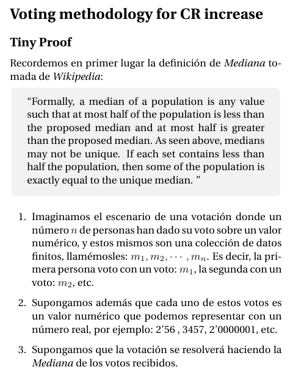
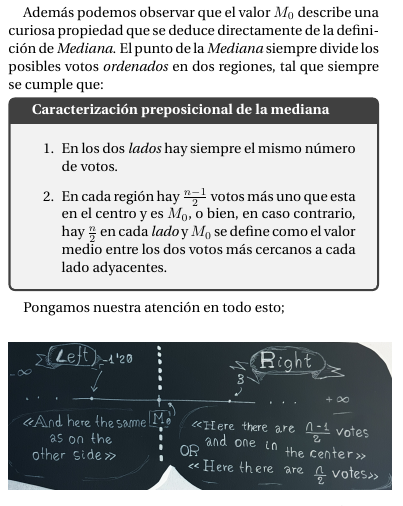
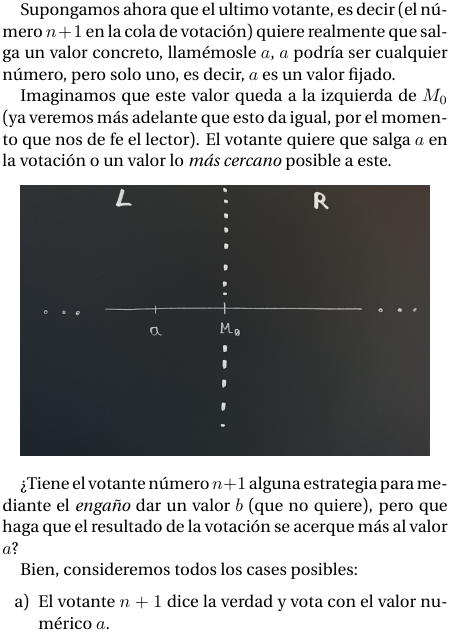
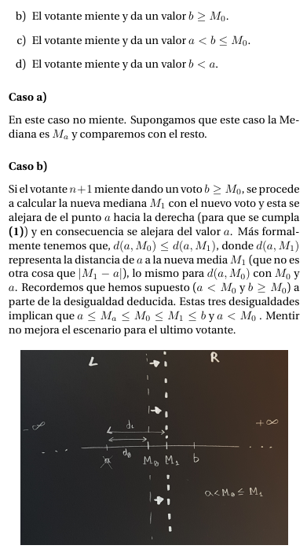
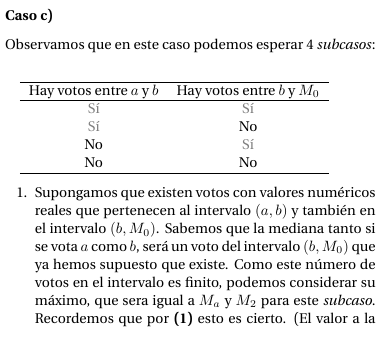
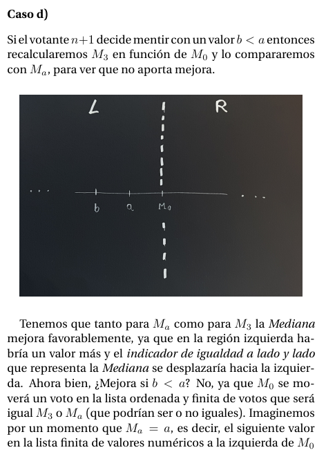
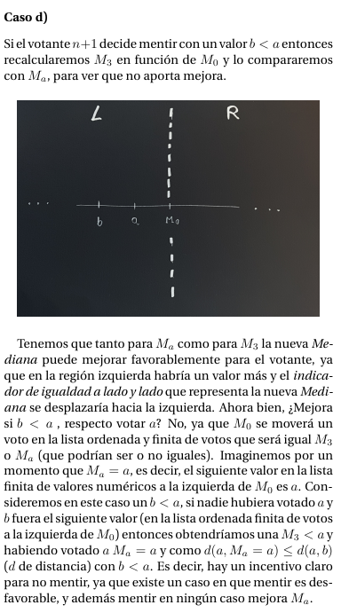
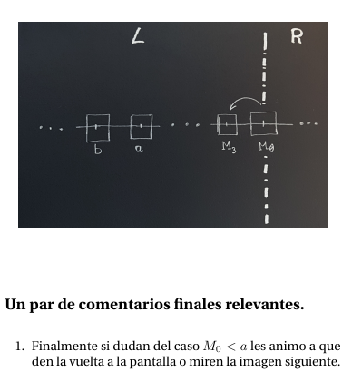
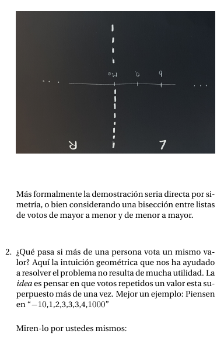

 Voting methodology for CR increase

## Report errors
| ■ | Date | Position | Description |
| ---- | ---------- | ------------ | ---------------------------|
| 🗹 | 2021-02-04 | Case d | It remains to be seen. |
| 🗹 | 2021-02-04 | The case b | Inequality is not strict. |
| 🗹 | 2021-02-04 | Final | Comment on equal votes. |
| 🗹 | 2021-02-05 | Section d | put 2 critical photos that facilitate "moooolts" compression. |
| 🗹 | 2021-02-05 | Final | put 2 make example photo repeated votes. | 

## Proof 

<!-- for i in {0..10}; do  echo -e "\n\"|sed 's/\\//g'; done
-->

