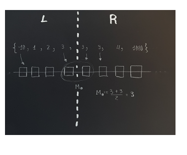

 Voting methodology for CR increase

## Report errors
| ■ | Date | Position | Description |
| ---- | ---------- | ------------ | ---------------------------|
| 🗹 | 2021-02-04 | Case d | It remains to be seen. |
| 🗹 | 2021-02-04 | The case b | Inequality is not strict. |
| 🗹 | 2021-02-04 | Final | Comment on equal votes. |
| 🗹 | 2021-02-05 | Section d | put 2 critical photos that facilitate "moooolts" compression. |
| 🗹 | 2021-02-05 | Final | put 2 make example photo repeated votes. | 
| 🗹 | 2021-02-05 | Section d | put 2 critical photos that facilitate "moooolts" compression. |
| 🗹 | 2021-02-05 | Final | put 2 make example photo repeated votes. |
| 🗹 | 2021-02-06 | Home | Remove unnecessary part of the Wiki definition. |
| 🗹 | 2021-02-06 | Case b) | Delete "does not meet definition". |
| 🗹 | 2021-02-06 | Case b) | Remember that `d (a, M_0)` is `| M_0-a |`. |
| 🗹 | 2021-02-06 | Case b) | It is `$ d (a, M_0) \ leq d (a, M_1) $` and not `$ d (a, M_0) <d (a, M_1) $`. |
| 🗹 | 2021-02-06 | Case b) | Better `$ a \ leq M_a \ leq M_0 \ leq M_1 \ leq b $ y $ a <M_0 $` than `$ a <M_a \ leq M_0 \ leq M_1 \ leq b $`. |
| 🗹 | 2021-02-06 | Case b) | It is `$ d (a, M_0) \ leq d (a, M_1) $` and not `$ d (a, M_0) <d (a, M_1) $`. |
| 🗹 | 2021-02-06 | Case c) | Finally considering 4 sub cases has already come out. |
| 🗹 | 2021-02-06 | Case d) | _We have that ..._ It doesn't necessarily improve ~ (Added _new_x2 and _can improve_. I think already.) ~ 

## Proof 

<!-- for i in {0..10}; do  echo -e "\n\"|sed 's/\\//g'; done
-->

